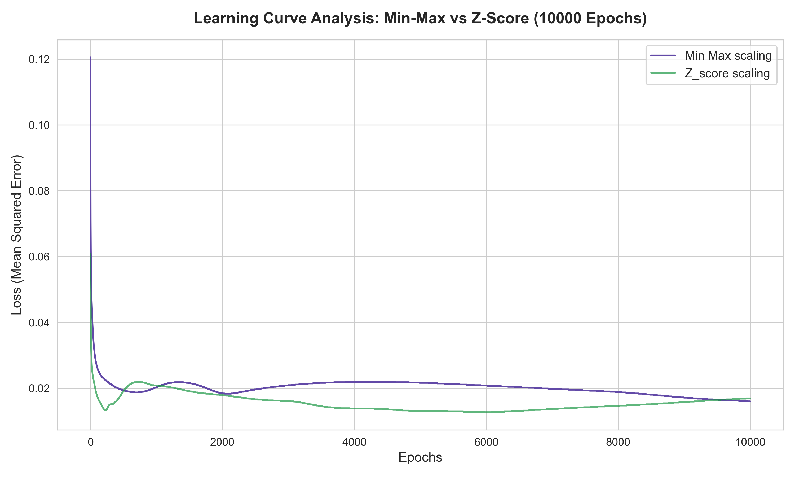
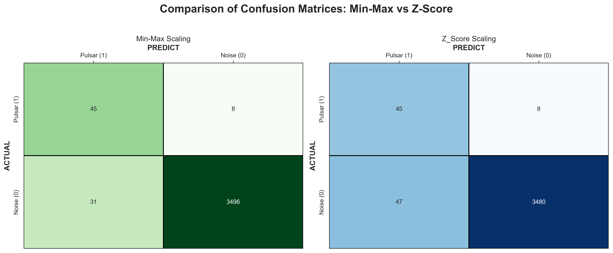
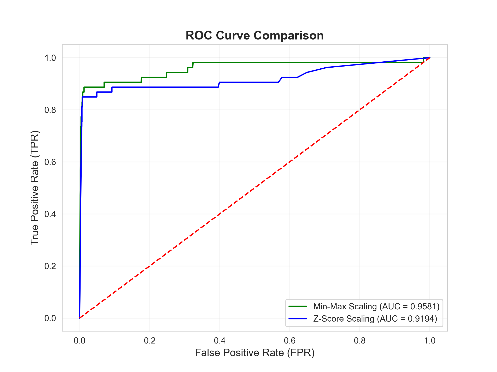
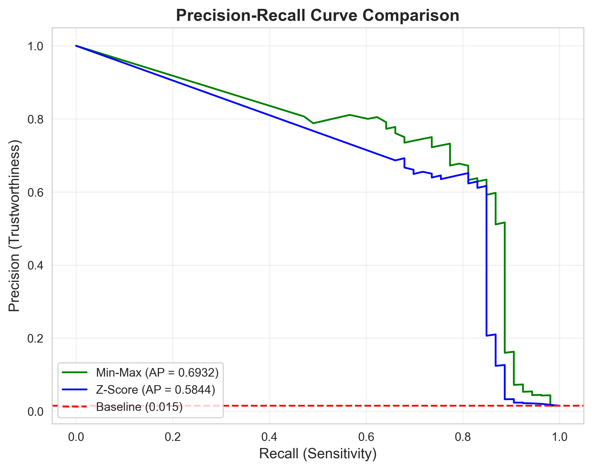

<div align="center">

# Pointless Neurons

</div>


**Autorzy:** Filip Paciorek, Maksymilian Buś 


## O projekcie
Celem projektu jest wykrycie pulsarów w szumie kosmicznym za pomocą własnoręcznie zaimplementowanej sieci neuronowej w  C. Cała architektura została napisana od zera, bez użycia gotowych bibliotek uczenia maszynowego. **Dane pochodzą ze zbioru [HTRU2](https://archive.ics.uci.edu/dataset/372/htru2)**.

**Główne wyzwanie:**
Analiza sygnałów radiowych charakteryzujących się ekstremalnym niezbalansowaniem klas. Wymagało to wdrożenia precyzyjnego pipelinu  danych, w tym metod oversamplingu i zaawansowanego skalowania aby wykorzystać potężny potecjał modelu.

Projekt obejmuje pełny proces analityczny: 
* Profilowanie i czyszczenie danych surowych.
* Równoważenie zbioru metodą Oversamplingu.
* Porównawczą analizę metod skalowania (Min-Max vs Z-Score).
* Implementację i trening sieci metodą Mini-Batch SGD.
* Ewaluację przy użyciu metryk odpornych na niezbalansowanie (MCC, Brier Score itd).

---

## Struktura projektu
* [`main.c`](main.c) - Główny moduł sterujący procesem ładowania i treningu.
* [`brain.c`](brain.c) / [`brain.h`](brain.h) - Logika sieci (Backpropagation, Sigmoid, Xavier init).
* [`body.c`](body.c) / [`nn.h`](nn.h) - Moduł przetwarzania danych i kalkulacji metryk.
* [`matrix.c`](matrix.c) - Wydajne operacje macierzowe zoptymalizowane pod tablice 1D.
* [`plots_maker.py`](plots_maker.py) - Skrypt Python do zaawansowanej wizualizacji wyników.
* [`code_explanation.txt`](code_explanation.txt) - Głęboką analiza matematyczna i techniczna projektu.

---

<div align="center">

## Analiza Wyników i Wnioski

### 1. Krzywa Uczenia (Learning Curve)


</div>

<div align = justify style="background-color: #333333; padding: 15px; border-radius: 5px; border: 1px solid #555;">
<strong>Analiza:</strong> Skalowanie Min-Max (linia fioletowa) wykazuje szybką i stabilną zbieżność (convergence) do niskiego poziomu błędu MSE. W przeciwieństwie do niego, metoda Z-Score (linia zielona) wykazuje tendencje do oscylacji i niestabilności stochastycznej po początkowej fazie spadkowej, co sugeruje trudności w optymalizacji wag przy tym rozkładzie danych.
</div>

<div align="center"s>

### 2. Macierze Pomyłek (Confusion Matrices)


</div>

<div align = justify  style="background-color: #333333; padding: 15px; border-radius: 5px; border: 1px solid #555;">
<strong>Analiza:</strong> Przy identycznej czułości (Recall), model oparty na skalowaniu Min-Max drastycznie redukuje liczbę błędów I rodzaju (False Positives) o blisko 45%. W kontekście badań astronomicznych jest to kluczowe, gdyż pozwala na znaczną oszczędność zasobów poprzez eliminację fałszywych sygnałów przy zachowaniu wysokiej wykrywalności rzeczywistych obiektów.
</div>


<div align="center">

### 3. Krzywa ROC (Receiver Operating Characteristic)


</div>


<div align = justify  style="background-color: #333333; padding: 15px; border-radius: 5px; border: 1px solid #555;">

<strong>Analiza:</strong> Analiza krzywych ROC sugeruje wyższość <strong>Min-Max (AUC = 0.9669)</strong> nad Z-Score (AUC = 0.9465). Należy jednak zachować ostrożność w interpretacji tego wykresu. Przy tak ekstremalnie niezbalansowanym zbiorze krzywa ROC bywa nadmiernie optymistyczna, ponieważ gigantyczna ilość klasy negatywnej (szumu) maskuje błędy typu False Positive. Z tego powodu krzywa ta służy tu jedynie jako pogląd, a prawdziwym sprawdzianem dla modeli jest krzywa Precision-Recall (PR Curve).
</div>
<div align="center">

### 4. Krzywa Precision-Recall (PR Curve)


</div>


<div align = justify  style="background-color: #333333; padding: 15px; border-radius: 5px; border: 1px solid #555;">
<strong>Analiza:</strong> Krzywa PR to dla nas ostateczny test  przy tak mocno niezbalansowanych danych. Wyraźnie pokazuje ona, że model <strong>Min-Max (AP = 0.6667)</strong> radzi sobie dużo lepiej. Co bardzo ciekawe, na wykresie widać gwałtowne załamanie w okolicach progu <strong>Recall = 0.85</strong>.Oznacza to, że nasza sieć bez problemu i z dużą precyzją wyłapuje 85% pulsarów, ale pozostałe 15% jest tak głęboko zakopane w szumie kosmicznym, że stają się one dla tego modelu po prostu nie do odróżnienia od tła. Zderzyliśmy się tu ze "ścianą" i naturalnym limitem naszej obecnej architektury.
</div>
<br>

# Podsumowanie
<div style="font-size: 1.05em; text-align: justify; background-color: #333333; padding: 15px; border-radius: 5px; border: 1px solid #7b32c0;">
  Wyniki jednoznacznie wskazują na <strong>skalowanie Min-Max</strong> jako optymalną metodę przygotowania danych dla tego zbioru. Model ten nie tylko uczy się stabilniej, ale przede wszystkim oferuje wyższą precyzję, co w praktyce w zestawieniu z Z-Score czyni go bardzo dobrym modelem.
</div>

<br>

---

> **Uwaga:** Szczegółowy opis techniczny algorytmów i decyzji projektowych znajduje się w pliku [`code_explanation.txt`](code_explanation.txt).

## Jak uruchomić?
1. Kompilacja (wymaga biblioteki `-lm`):
   ```bash
   gcc main.c brain.c body.c matrix.c -o pulsary -lm

