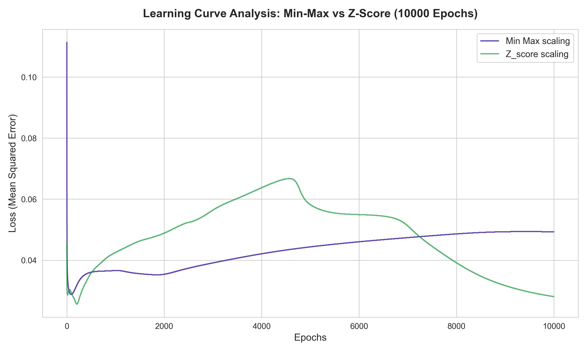
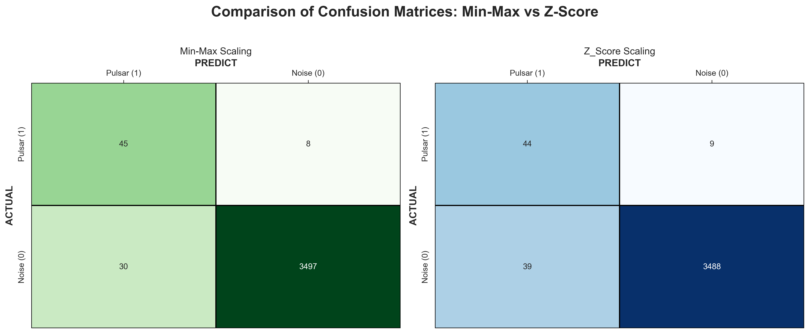
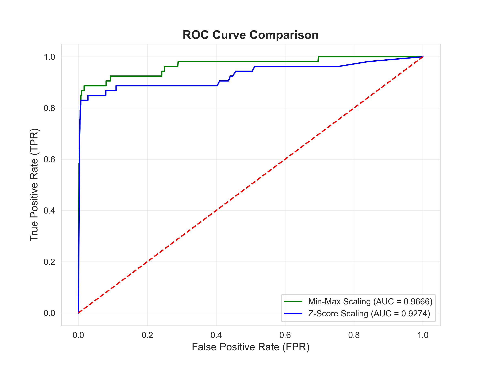

<div align="center">

# Pointless Neurons

</div>

**Autorzy:** Filip Paciorek, Maksymilian Buś 

## O projekcie
Celem projektu jest wykrycie pulsarów w szumie kosmicznym za pomocą własnoręcznie zaimplementowanej sieci neuronowej w C. Cała architektura została napisana od zera, bez użycia gotowych bibliotek uczenia maszynowego. **Dane pochodzą ze zbioru [HTRU2](https://archive.ics.uci.edu/dataset/372/htru2)**.

**Główne wyzwanie:**
Analiza sygnałów radiowych charakteryzujących się ekstremalnym niezbalansowaniem klas. Wymagało to wdrożenia precyzyjnego pipelinu danych, w tym metod oversamplingu i zaawansowanego skalowania aby wykorzystać potężny potecjał modelu.

Projekt obejmuje pełny proces analityczny: 
* Profilowanie i czyszczenie danych surowych.
* Równoważenie zbioru metodą Oversamplingu.
* Porównawczą analizę metod skalowania (Min-Max vs Z-Score).
* Implementację i trening sieci metodą Mini-Batch SGD.
* Ewaluację przy użyciu metryk odpornych na niezbalansowanie (MCC, Brier Score itd).

---

## Struktura projektu
* [`main.c`](main.c) - Główny moduł sterujący procesem ładowania i treningu.
* [`brain.c`](brain.c) / [`brain.h`](brain.h) - Logika sieci (Backpropagation, Sigmoid, Xavier init).
* [`body.c`](body.c) / [`nn.h`](nn.h) - Moduł przetwarzania danych i kalkulacji metryk.
* [`matrix.c`](matrix.c) - Wydajne operacje macierzowe zoptymalizowane pod tablice 1D.
* [`plots_maker.py`](plots_maker.py) - Skrypt Python do  wizualizacji wyników.
* [`code_explanation.txt`](code_explanation.txt) - Głęboką analiza matematyczna i techniczna projektu.

---

<div align="center">

## Analiza Wyników i Wnioski
### 1. Analiza metryk dla poszczegolnych stadaryzacji
| Metryka / Klasyfikacja |  Z-SCORE + OVERSAMPLING |  MIN-MAX + OVERSAMPLING |
| :--- | :---: | :---: |
| **Accuracy (Dokładność)**   | 98.66%           | 98.94% |
| **Precision (Precyzja)**    | 53.01%           | 60% |
| **Recall (Czułość)**        | 83.02%           | 84.91%|
| **F1-Score**                | 0.6471           | 0.7031 |
| **MCC**                     | 0.6574           | 0.7088  |
| **Brier Score**             | 0.0170           | 0.0160 |
| **Trafiony Pulsar (TP)**    | 44               | 45 |
| **Przeoczony Pulsar (FN)**  | 9                | 8 |
| **Błędny Pulsar (FP)**      | 39               | 30 |
| **Prawdziwy Szum (TN)**     |3488              | 3497 |

</div>
<div >
    <div style="text-align: justify; background-color: #333333; padding: 15px; border-radius: 5px; border: 1px solid #555; max-width: 900px;">
        <strong>Analiza porównawcza metryk (Min-Max vs Z-Score):</strong>
        <br><br>
        <ul>
            <li><strong>Recall (84.91% vs 83.02%):</strong> Min-Max wykazuje wyższą czułość, wyłapując 45 pulsarów (TP) o jeden więcej niż Z-score.</li>
            <li><strong>Specificity (99.15% vs 98.89%):</strong> Obie metody świetnie filtrują szum, ale Min-Max rzadziej generuje fałszywe alarmy (30 FP) w porównaniu do Z-Score (39 FP).</li>
            <li><strong>F1-Score (0.7031 vs 0.6471):</strong> Wyraźna przewaga Min-Max. Wyższy balans między precyzją a czułością potwierdza, że model lepiej radzi sobie z nierównością klas po tym skalowaniu.</li>
            <li><strong>Brier Score (0.0160 vs 0.0170):</strong> Niższy wynik dla Min-Max wskazuje na większą pewność sieci w trafnych predykcjach i mniejszą liczbę błędów o dużym znaczeniu statystycznym.</li>
            <li><strong>MCC (0.7088 vs 0.6574):</strong> Współczynnik Matthewsa ostatecznie potwierdza, że Min-Max daje bardziej rzetelne wyniki, które nie są dziełem przypadku wynikającego z przewagi szumu w danych.</li>
        </ul>
        <strong>Wniosek:</strong> Choć obie metody są skuteczne, <strong>Min-Max</strong> dominuje w każdej kategorii, oferując model o większej czułości i mniejszej liczbie pomyłek.
    </div>
</div>


<div align="center">

### 2. Krzywa Uczenia (Learning Curve)


</div>

<div align="center">
    <div style="text-align: justify; background-color: #333333; padding: 15px; border-radius: 5px; border: 1px solid #555; max-width: 900px;">
        <strong>Analiza:</strong> Wykres ujawnia odmienne zachowanie obu metod. <strong>Min-Max (fioletowa)</strong> charakteryzuje się wzorcową stabilnością i błyskawiczną zbieżnością, co czyni go przewidywalnym wyborem. Z kolei <strong>Z-Score (zielona)</strong> przechodzi przez fazę silnej niestabilności (tzw. "garb" między 4 a 6 tys. epok), co sugeruje trudniejszą optymalizację wag. Mimo to, w końcowej fazie Z-Score osiąga niższy błąd matematyczny (Loss), co pokazuje, że przy długotrwałym treningu ta metoda potrafi głębiej dopasować się do danych, choć kosztem mniejszej przewidywalności procesu nauki.
    </div>
</div>

<div align="center">

### 3. Macierze Pomyłek (Confusion Matrices)


</div>

<div align="center">
    <div style="text-align: justify; background-color: #333333; padding: 15px; border-radius: 5px; border: 1px solid #555; max-width: 900px;">
        <strong>Analiza:</strong> Macierze pomyłek jasno wskazują na przewagę <strong>Min-Max Scaling</strong>. Przy wyższej czułości (wykryto 45 pulsarów vs 44 dla Z-Score), model ten jednocześnie skuteczniej redukuje liczbę fałszywych alarmów (30 FP względem 39 dla Z-Score). W kontekście badań astronomicznych jest to kluczowe, gdyż pozwala na eliminację błędnych sygnałów przy zachowaniu maksymalnej wykrywalności rzeczywistych obiektów, co przekłada się na większą wiarygodność całego systemu detekcji.
    </div>
</div>


<div align="center">

### 4. Krzywa ROC (Receiver Operating Characteristic)


</div>


<div align="center">
    <div style="text-align: justify; background-color: #333333; padding: 15px; border-radius: 5px; border: 1px solid #555; max-width: 900px;">
        <strong>Analiza:</strong> Krzywa ROC potwierdza bardzo wysoką zdolność separacji klas przez oba modele. <strong>Min-Max (AUC&nbsp;=&nbsp;0.9666)</strong> wygrywa z <strong>Z-Score (AUC&nbsp;=&nbsp;0.9274)</strong>, szybciej pnąc się ku lewemu górnemu rogowi wykresu. Należy jednak pamiętać, że przy tak niezbalansowanym zbiorze (ogromna przewaga szumu), krzywa ROC może być zbyt optymistyczna. Dlatego wynik ten traktujemy jako potwierdzenie ogólnej stabilności modelu, podczas gdy kluczowym sprawdzianem pozostaje krzywa Precision-Recall.
    </div>
</div>

<div align="center">

### 5. Krzywa Precision-Recall (PR Curve)


</div>


<div style="text-align: justify; background-color: #333333; padding: 15px; border-radius: 5px; border: 1px solid #555;">
<strong>Analiza:</strong> Krzywa PR to dla nas ostateczny test przy tak mocno niezbalansowanych danych. Wyraźnie pokazuje ona, że model <strong>Min-Max (AP = 0.6936)</strong> radzi sobie dużo lepiej. Co bardzo ciekawe, na wykresie widać gwałtowne załamanie w okolicach progu <strong>Recall ~0.85</strong>. Oznacza to, że nasza sieć bez problemu i z dużą precyzją wyłapuje 85% pulsarów, ale pozostałe 15% jest tak głęboko zakopane w szumie kosmicznym, że stają się one dla tego modelu po prostu nie do odróżnienia od tła. Zderzyliśmy się tu ze "ścianą" i naturalnym limitem naszej obecnej architektury.
</div>
<br>

# Podsumowanie
<div style="font-size: 1.05em; text-align: justify; background-color: #333333; padding: 15px; border-radius: 5px; border: 1px solid #7b32c0;">
  Wyniki jednoznacznie wskazują na <strong>skalowanie Min-Max</strong> jako optymalną metodę przygotowania danych dla tego zbioru. Model ten nie tylko uczy się stabilniej, ale przede wszystkim oferuje wyższą precyzję, co w praktyce w zestawieniu z Z-Score czyni go bardzo dobrym modelem.
</div>

<br>

---

> **Uwaga:** Szczegółowy opis techniczny algorytmów i decyzji projektowych znajduje się w pliku [`code_explanation.txt`](code_explanation.txt).

## Jak uruchomić?
1. Kompilacja (wymaga biblioteki `-lm`):
   ```bash
   gcc main.c brain.c body.c matrix.c -o pulsary -lm
2. Uruchomienie programu dla systemu Windows
    ```bash
    .\pulsary.exe
3. Uruchomienie programu dla systemu Linux
    ```bash
    ./pulsary